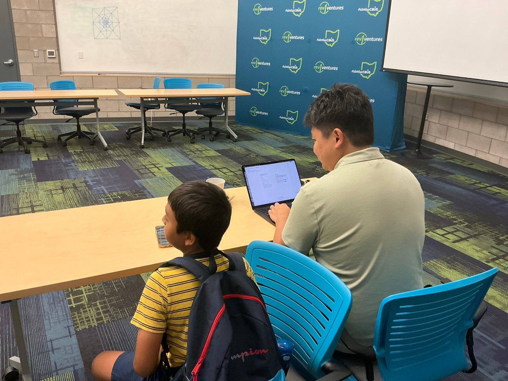
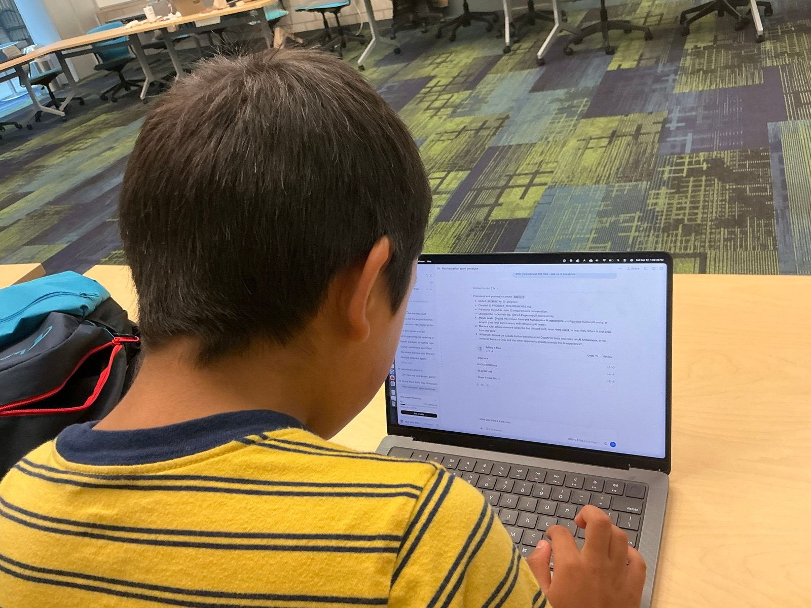
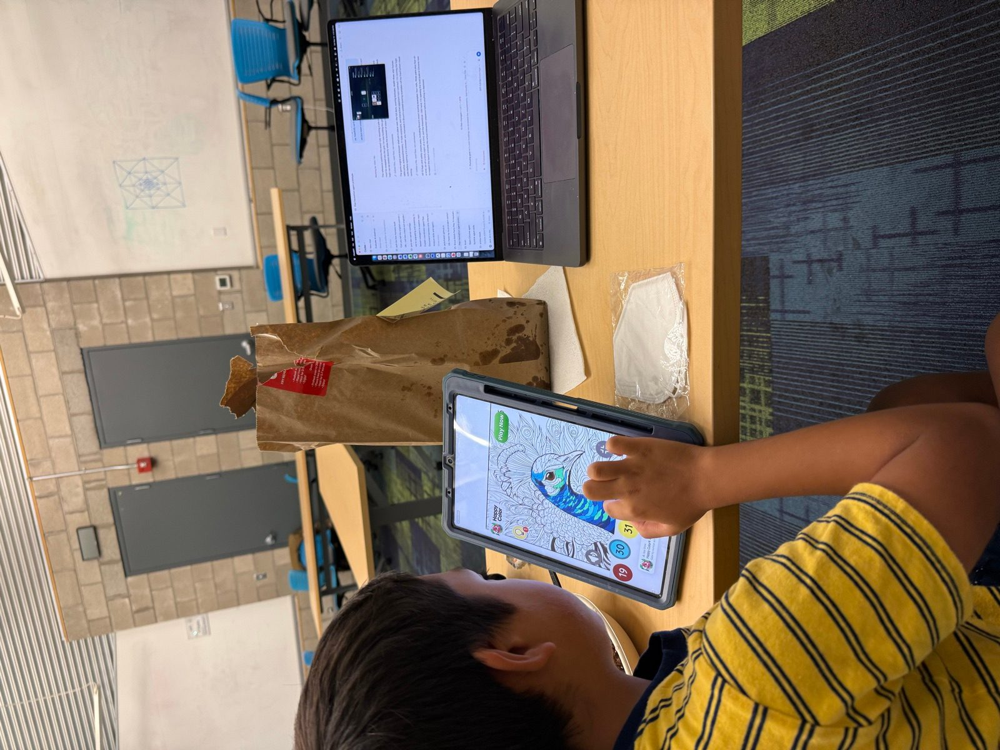
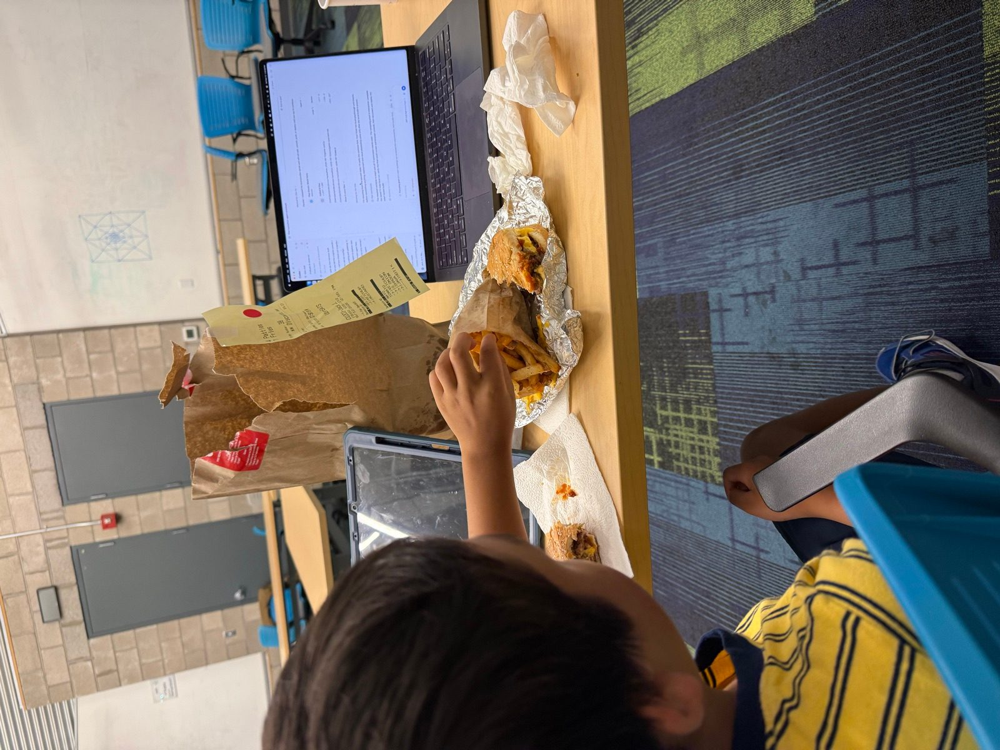
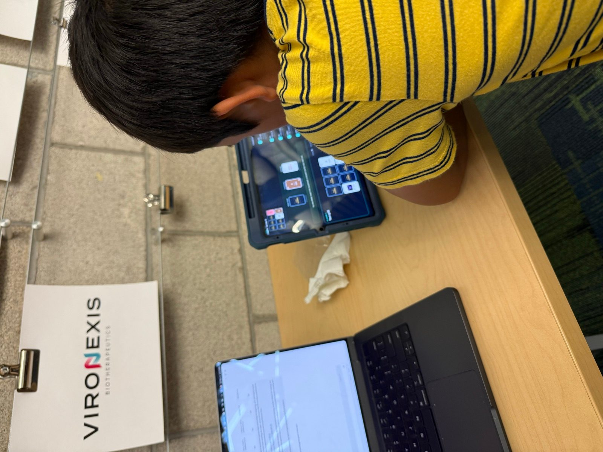

# Hackathon Picture Log

Photos from Jack and Bruce’s build day at the AI Tinkerers Columbus “Agents, Everywhere” hackathon.

## September 12, 2026

### 11:26 AM — Starting in another room

Jack and Bruce work together in the room where they started the day, before moving to a different hackathon room.

### 11:44 AM — Building together at Rev1 Labs

Jack and Bruce settle in together with the project open on the laptop and the Columbus hackathon room around them.

### 11:44 AM — Building side by side

Jack and Bruce work side by side in Columbus while Bruce continues drafting the product requirements document.

### 1:02 PM — Bruce reviews the requirements

Bruce works directly with the project conversation after finishing the first product requirements draft.

### 1:31 PM — A quick coloring break

Bruce takes a short coloring break while the Play Eleven requirements and build work stay open beside him.

### 1:43 PM — Lunch and building

Lunch arrives in the build room while the project keeps moving toward a playable version.

### 2:42 PM — Bruce tests Play Eleven

Bruce plays the finished game on a tablet while the project workspace remains open on the laptop.
